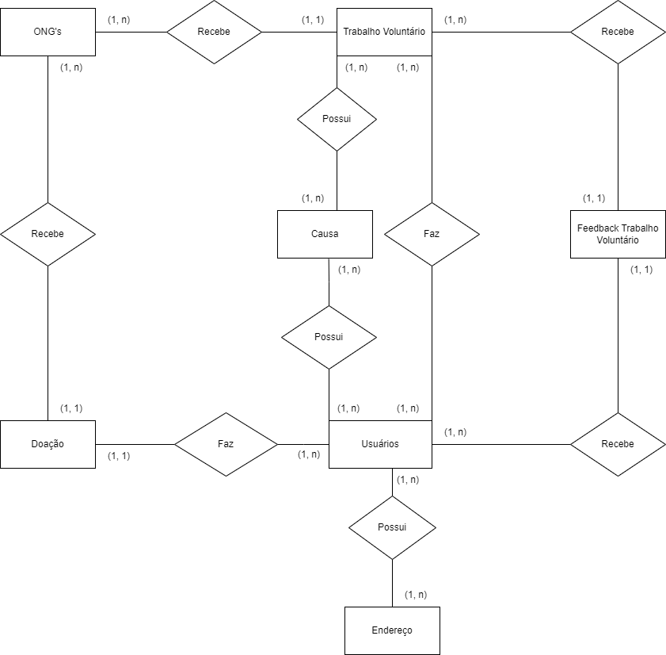
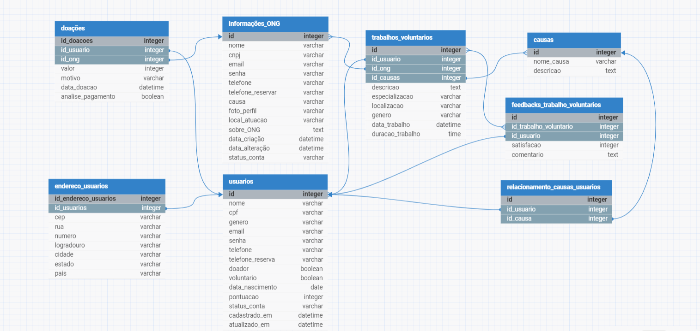

# Banco de Dados - Impacto

## Descrição:
Nesse repositório se encontra o banco de dados geral

## Modelo Conceitual:


<br>

## Modelo Lógico:

<br>

## Modelo Físico:

```sql

CREATE DATABASE IF NOT EXISTS database_impacto;

USE database_impacto;

-- Tabelas para o Usuário e ONGs
CREATE TABLE IF NOT EXISTS usuarios (
    id_usuarios INT NOT NULL UNIQUE AUTO_INCREMENT,
    nome VARCHAR(255) NOT NULL,
    cpf VARCHAR(16) NOT NULL UNIQUE,
    data_nascimento DATE NOT NULL,
    genero ENUM('masculino', 'feminino', 'outros') NOT NULL,
    email VARCHAR(255) NOT NULL,
    senha VARCHAR(255) NOT NULL,
    telefone VARCHAR(20) NOT NULL,
    status_conta ENUM('ativo', 'inativo', 'bloqueado') NOT NULL DEFAULT 'ativo',
    interesses ENUM('doador', 'voluntario', 'ambos'),
    pontos INT NOT NULL DEFAULT 0,
	cadastrado_em TIMESTAMP NOT NULL DEFAULT CURRENT_TIMESTAMP,
    atualizado_em TIMESTAMP NOT NULL DEFAULT CURRENT_TIMESTAMP ON UPDATE CURRENT_TIMESTAMP,
    PRIMARY KEY (id_usuarios),
    INDEX (nome),
    INDEX (email),
    INDEX (telefone)
);

CREATE TABLE IF NOT EXISTS ongs(
    id_ongs INT NOT NULL UNIQUE AUTO_INCREMENT,
    nome VARCHAR(255) NOT NULL,
    cnpj VARCHAR(20) NOT NULL UNIQUE,
    email VARCHAR(255) NOT NULL,
    senha VARCHAR(255) NOT NULL,
    telefone VARCHAR(18) NOT NULL,
    telefone_reserva VARCHAR(18) NULL,
    causa VARCHAR(255) NOT NULL,
    foto_perfil VARCHAR(255) NULL,
    local_atuacao VARCHAR(255) NOT NULL,
    sobre_ong TEXT NULL,
    cadastrado_em TIMESTAMP NOT NULL DEFAULT CURRENT_TIMESTAMP,
    atualizado_em TIMESTAMP NOT NULL DEFAULT CURRENT_TIMESTAMP ON UPDATE CURRENT_TIMESTAMP,
    status_conta ENUM('ativo', 'inativo', 'bloqueado') NOT NULL DEFAULT 'ativo',
    PRIMARY KEY (id_ongs),
    INDEX (nome),
    INDEX (causa),
    INDEX (email),
    INDEX (cnpj)
);

-- Tabelas para doações, causas e trabalhos voluntários
CREATE TABLE IF NOT EXISTS doacoes(
    id_doacoes INT NOT NULL UNIQUE AUTO_INCREMENT,
    valor DECIMAL(10, 2) NOT NULL,
    motivo VARCHAR(255) NULL,
    data_doacao TIMESTAMP NOT NULL DEFAULT CURRENT_TIMESTAMP,
    analise_pagamento BOOLEAN NOT NULL DEFAULT false,
    id_usuarios INT NOT NULL,
    id_ongs INT NOT NULL,
    PRIMARY KEY (id_doacoes),
    FOREIGN KEY (id_usuarios) REFERENCES usuarios(id_usuarios),
    FOREIGN KEY (id_ongs) REFERENCES ongs(id_ongs),
    INDEX (id_usuarios),
    INDEX (id_ongs),
    CHECK (valor > 0)
);

CREATE TABLE IF NOT EXISTS causas(
    id_causas INT NOT NULL UNIQUE AUTO_INCREMENT,
    nome_causa VARCHAR(255) NOT NULL UNIQUE,
    descricao TEXT,
    PRIMARY KEY (id_causas),
    INDEX (nome_causa)
);

CREATE TABLE IF NOT EXISTS trabalhos_voluntarios(
    id_trabalhos_voluntarios INT NOT NULL UNIQUE AUTO_INCREMENT,
    descricao TEXT NOT NULL,
    especializacao VARCHAR(255) NOT NULL,
    localizacao VARCHAR(255) NOT NULL,
    genero ENUM('feminino', 'masculino', 'outros') NOT NULL,
    data_trabalho TIMESTAMP NOT NULL DEFAULT CURRENT_TIMESTAMP,
    duracao_trabalho TIME NOT NULL,
    id_usuarios INT NOT NULL,
    id_ongs INT NOT NULL,
    id_causas INT NOT NULL,
    PRIMARY KEY (id_trabalhos_voluntarios),
    FOREIGN KEY (id_usuarios) REFERENCES usuarios(id_usuarios),
    FOREIGN KEY (id_ongs) REFERENCES ongs(id_ongs),
    FOREIGN KEY (id_causas) REFERENCES causas(id_causas),
    INDEX (especializacao),
    INDEX (id_usuarios),
    INDEX (id_ongs),
    INDEX (id_causas)
);

-- Tabelas com o endereço do usuário e feedbacks
CREATE TABLE IF NOT EXISTS endereco_usuarios(
    id_endereco_usuarios INT NOT NULL UNIQUE AUTO_INCREMENT,
    cep VARCHAR(14) NOT NULL,
    rua VARCHAR(255) NOT NULL,
    numero VARCHAR(10) NOT NULL,
    logradouro VARCHAR(255) NOT NULL,
    cidade VARCHAR(100) NOT NULL,
    estado VARCHAR(100) NOT NULL,
    pais VARCHAR(100) NOT NULL DEFAULT 'Brasil',
    id_usuarios INT NOT NULL,
    PRIMARY KEY (id_endereco_usuarios),
    FOREIGN KEY (id_usuarios) REFERENCES usuarios(id_usuarios),
    INDEX (id_usuarios),
    INDEX (pais)
);

CREATE TABLE IF NOT EXISTS feedback_tabalho(
    id_feedback_trabalho INT NOT NULL UNIQUE AUTO_INCREMENT,
    satisfacao TINYINT NULL,
    comentario TEXT NULL,
    id_usuarios INT NOT NULL,
    id_trabalhos_voluntarios INT NOT NULL,
    PRIMARY KEY (id_feedback_trabalho),
    FOREIGN KEY (id_usuarios) REFERENCES usuarios(id_usuarios),
    FOREIGN KEY (id_trabalhos_voluntarios) REFERENCES trabalhos_voluntarios(id_trabalhos_voluntarios),
    INDEX (id_usuarios),
    INDEX (id_trabalhos_voluntarios)
);

-- Tabela que relaciona causas e usuários
CREATE TABLE IF NOT EXISTS causas_usuarios (
    id_causas_usuarios INT NOT NULL UNIQUE AUTO_INCREMENT,
    id_usuarios INT NOT NULL,
    id_causas INT NOT NULL,
    PRIMARY KEY (id_causas_usuarios),
    FOREIGN KEY (id_usuarios) REFERENCES usuarios(id_usuarios),
    FOREIGN KEY (id_causas) REFERENCES causas(id_causas),
    INDEX (id_usuarios),
    INDEX (id_causas)
);

```